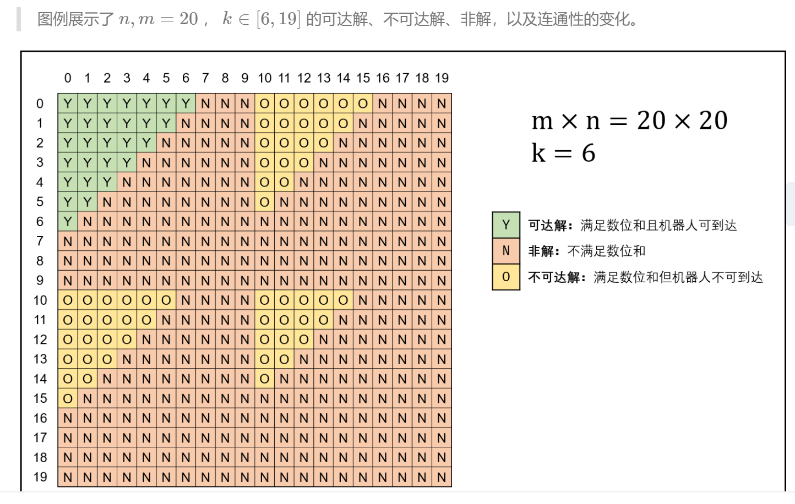

# INDEX

题目索引、类别、阐述

## Leetcode

### 42. 接雨水

```
/**
 * 42. 接雨水
 * 给定 n 个非负整数表示每个宽度为 1 的柱子的高度图，计算按此排列的柱子，下雨之后能接多少雨水。
 *
 * 上面是由数组 [0,1,0,2,1,0,1,3,2,1,2,1] 表示的高度图，在这种情况下，可以接 6 个单位的雨水（蓝色部分表示雨水）。 感谢 Marcos 贡献此图。
 *
 * 示例:
 *
 * 输入: [0,1,0,2,1,0,1,3,2,1,2,1]
 * 输出: 6
 *
 */
```


**双指针分别从左右扫描，充分利用条件**

------

### 72.编辑距离

```
/**
 * 72. 编辑距离
 * 给你两个单词 word1 和 word2，请你计算出将 word1 转换成 word2 所使用的最少操作数 。
 *
 * 你可以对一个单词进行如下三种操作：
 *
 * 插入一个字符
 * 删除一个字符
 * 替换一个字符
 *  
 * 示例 1：
 *
 * 输入：word1 = "horse", word2 = "ros"
 * 输出：3
 * 解释：
 * horse -> rorse (将 'h' 替换为 'r')
 * rorse -> rose (删除 'r')
 * rose -> ros (删除 'e')
 * 示例 2：
 *
 * 输入：word1 = "intention", word2 = "execution"
 * 输出：5
 * 解释：
 * intention -> inention (删除 't')
 * inention -> enention (将 'i' 替换为 'e')
 * enention -> exention (将 'n' 替换为 'x')
 * exention -> exection (将 'n' 替换为 'c')
 * exection -> execution (插入 'u')
 *
 */
```

**对于等号左右两个元素来说，插入与删除操作可以看成是一种操作，之后找DP规律**

------

### 239. 滑动窗口最大值

```
/**
 * 239. 滑动窗口最大值
 * 给定一个数组 nums，有一个大小为 k 的滑动窗口从数组的最左侧移动到数组的最右侧。你只可以看到在滑动窗口内的 k 个数字。滑动窗口每次只向右移动一位。
 *
 * 返回滑动窗口中的最大值。
 *
 * 进阶：
 *
 * 你能在线性时间复杂度内解决此题吗？
 *
 * 示例:
 *
 * 输入: nums = [1,3,-1,-3,5,3,6,7], 和 k = 3
 * 输出: [3,3,5,5,6,7]
 * 解释:
 *
 *   滑动窗口的位置                最大值
 * ---------------               -----
 * [1  3  -1] -3  5  3  6  7       3
 *  1 [3  -1  -3] 5  3  6  7       3
 *  1  3 [-1  -3  5] 3  6  7       5
 *  1  3  -1 [-3  5  3] 6  7       5
 *  1  3  -1  -3 [5  3  6] 7       6
 *  1  3  -1  -3  5 [3  6  7]      7
 *
 * 提示：
 *
 * 1 <= nums.length <= 10^5
 * -10^4 <= nums[i] <= 10^4
 * 1 <= k <= nums.length
 *
 */
```

**O(n)时间复杂度解决此题，可维护双端队列，保持队列头为当前窗口最大值，每次窗口移动后清理队列中元素**

------

### 460. LFU缓存

```
/**
 * 460. LFU缓存
 * 设计并实现最不经常使用（LFU）缓存的数据结构。它应该支持以下操作：get 和 put。
 *
 * get(key) - 如果键存在于缓存中，则获取键的值（总是正数），否则返回 -1。
 * put(key, value) - 如果键不存在，请设置或插入值。当缓存达到其容量时，它应该在插入新项目之前，使最不经常使用的项目无效。在此问题中，当存在平局（即两个或更多个键具有相同使用频率）时，最近最少使用的键将被去除。
 *
 * 进阶：
 * 你是否可以在 O(1) 时间复杂度内执行两项操作？
 *
 * 示例：
 *
 * LFUCache cache = new LFUCache( 2  capacity (缓存容量)  )
 * cache.put(1, 1);
 * cache.put(2, 2);
 * cache.get(1);       // 返回 1
 * cache.put(3, 3);    // 去除 key 2
 * cache.get(2);       // 返回 -1 (未找到key 2)
 * cache.get(3);       // 返回 3
 * cache.put(4, 4);    // 去除 key 1
 * cache.get(1);       // 返回 -1 (未找到 key 1)
 * cache.get(3);       // 返回 3
 * cache.get(4);       // 返回 4
 */
```

缓存设计，注意储存访问次数，O(1)时间复杂度实现get与put，使用双向链表，双向链表应该有前后哨兵指针。get时将结点提至最前。put时，已存在则增加频率，提至最前，若不存在，先删除末尾结点，删除map中对应频率，增加频率为1的结点至链表头

------

### 887. 鸡蛋掉落

```
887. 鸡蛋掉落
你将获得 K 个鸡蛋，并可以使用一栋从 1 到 N  共有 N 层楼的建筑。
每个蛋的功能都是一样的，如果一个蛋碎了，你就不能再把它掉下去。
你知道存在楼层 F ，满足 0 <= F <= N 任何从高于 F 的楼层落下的鸡蛋都会碎，从 F 楼层或比它低的楼层落下的鸡蛋都不会破。
每次移动，你可以取一个鸡蛋（如果你有完整的鸡蛋）并把它从任一楼层 X 扔下（满足 1 <= X <= N）。
你的目标是确切地知道 F 的值是多少。
无论 F 的初始值如何，你确定 F 的值的最小移动次数是多少？

示例 1：
输入：K = 1, N = 2
输出：2
解释：
鸡蛋从 1 楼掉落。如果它碎了，我们肯定知道 F = 0 。
否则，鸡蛋从 2 楼掉落。如果它碎了，我们肯定知道 F = 1 。
如果它没碎，那么我们肯定知道 F = 2 。
因此，在最坏的情况下我们需要移动 2 次以确定 F 是多少。
示例 2：

输入：K = 2, N = 6
输出：3
示例 3：

输入：K = 3, N = 14
输出：4
提示：
1 <= K <= 100
1 <= N <= 10000
```

dp

------

### 面试题13. 机器人的运动范围

```
/**
 * 面试题13. 机器人的运动范围
 * 地上有一个m行n列的方格，从坐标 [0,0] 到坐标 [m-1,n-1] 。一个机器人从坐标 [0, 0] 的格子开始移动，它每次可以向左、右、上、下移动一格（不能移动到方格外），也不能进入行坐标和列坐标的数位之和大于k的格子。例如，当k为18时，机器人能够进入方格 [35, 37] ，因为3+5+3+7=18。但它不能进入方格 [35, 38]，因为3+5+3+8=19。请问该机器人能够到达多少个格子？
 * 示例 1：
 *
 * 输入：m = 2, n = 3, k = 1
 * 输出：3
 * 示例 1：
 *
 * 输入：m = 3, n = 1, k = 0
 * 输出：1
 * 提示：
 *
 * 1 <= n,m <= 100
 * 0 <= k <= 20
 *
 */
```

简单提示：三角区域随着k增大而连成一片，从左上角开始，向左、下两个方向dfs



------

### 8. 字符串转换整数 (atoi)

```
/**
 * 8. 字符串转换整数 (atoi)
 * 请你来实现一个 atoi 函数，使其能将字符串转换成整数。
 *
 * 首先，该函数会根据需要丢弃无用的开头空格字符，直到寻找到第一个非空格的字符为止。接下来的转化规则如下：
 *
 * 如果第一个非空字符为正或者负号时，则将该符号与之后面尽可能多的连续数字字符组合起来，形成一个有符号整数。
 * 假如第一个非空字符是数字，则直接将其与之后连续的数字字符组合起来，形成一个整数。
 * 该字符串在有效的整数部分之后也可能会存在多余的字符，那么这些字符可以被忽略，它们对函数不应该造成影响。
 * 注意：假如该字符串中的第一个非空格字符不是一个有效整数字符、字符串为空或字符串仅包含空白字符时，则你的函数不需要进行转换，即无法进行有效转换。
 *
 * 在任何情况下，若函数不能进行有效的转换时，请返回 0 。
 *
 * 提示：
 *
 * 本题中的空白字符只包括空格字符 ' ' 。
 * 假设我们的环境只能存储 32 位大小的有符号整数，那么其数值范围为 [−231,  231 − 1]。如果数值超过这个范围，请返回  INT_MAX (231 − 1) 或 INT_MIN (−231) 。
 *  
 *
 * 示例 1:
 *
 * 输入: "42"
 * 输出: 42
 * 示例 2:
 *
 * 输入: "   -42"
 * 输出: -42
 * 解释: 第一个非空白字符为 '-', 它是一个负号。
 *      我们尽可能将负号与后面所有连续出现的数字组合起来，最后得到 -42 。
 * 示例 3:
 *
 * 输入: "4193 with words"
 * 输出: 4193
 * 解释: 转换截止于数字 '3' ，因为它的下一个字符不为数字。
 * 示例 4:
 *
 * 输入: "words and 987"
 * 输出: 0
 * 解释: 第一个非空字符是 'w', 但它不是数字或正、负号。
 *      因此无法执行有效的转换。
 * 示例 5:
 *
 * 输入: "-91283472332"
 * 输出: -2147483648
 * 解释: 数字 "-91283472332" 超过 32 位有符号整数范围。
 *      因此返回 INT_MIN (−231) 。
 */
```

模拟题，res * 10 + tail

------

### 22.括号生成

```
/**
 * 22.括号生成
 * 给出 n 代表生成括号的对数，请你写出一个函数，使其能够生成所有可能的并且有效的括号组合。
 *
 * 例如，给出 n = 3，生成结果为：
 *
 * [
 *   "((()))",
 *   "(()())",
 *   "(())()",
 *   "()(())",
 *   "()()()"
 * ]
 *
 */
```

dfs+剪枝，或者dp  dp[i] = "(" + dp[j] + ")" + dp[i- j - 1] , j = 0, 1, ..., i - 1

------

### 24. 两两交换链表中的节点

```
/**
 * 24. 两两交换链表中的节点
 * 给定一个链表，两两交换其中相邻的节点，并返回交换后的链表。
 * 你不能只是单纯的改变节点内部的值，而是需要实际的进行节点交换。
 *
 * 示例:
 *
 * 给定 1->2->3->4, 你应该返回 2->1->4->3.
 *
 */
```

注意pre、cur、next关系

------

### 34.在排序数组中查找元素的第一个和最后一个位置

```
给定一个按照升序排列的整数数组 nums，和一个目标值 target。找出给定目标值在数组中的开始位置和结束位置。

你的算法时间复杂度必须是 O(log n) 级别。

如果数组中不存在目标值，返回 [-1, -1]。

示例 1:

输入: nums = [5,7,7,8,8,10], target = 8
输出: [3,4]
示例 2:

输入: nums = [5,7,7,8,8,10], target = 6
输出: [-1,-1]
```

复杂度为O(log n)，用二分查找，low，high，middle

------

### 面试题 01.07. 旋转矩阵

```
/**
 * 面试题 01.07. 旋转矩阵
 * 给你一幅由 len × len 矩阵表示的图像，其中每个像素的大小为 4 字节。请你设计一种算法，将图像旋转 90 度。
 *
 * 不占用额外内存空间能否做到？
 *
 * 示例 1:
 *
 * 给定 matrix =
 * [
 *   [1,2,3],
 *   [4,5,6],
 *   [7,8,9]
 * ],
 *
 * 原地旋转输入矩阵，使其变为:
 * [
 *   [7,4,1],
 *   [8,5,2],
 *   [9,6,3]
 * ]
 * 示例 2:
 *
 * 给定 matrix =
 * [
 *   [ 5, 1, 9,11],
 *   [ 2, 4, 8,10],
 *   [13, 3, 6, 7],
 *   [15,14,12,16]
 * ],
 *
 * 原地旋转输入矩阵，使其变为:
 * [
 *   [15,13, 2, 5],
 *   [14, 3, 4, 1],
 *   [12, 6, 8, 9],
 *   [16, 7,10,11]
 *
 */
```

关注矩阵左上角，利用temp元素暂存左上角内容，找规律，按区域分别计算区域的值

------

### 146.LRU缓存机制

```
/**
 * 146.LRU缓存机制
 * 运用你所掌握的数据结构，设计和实现一个  LRU (最近最少使用) 缓存机制。它应该支持以下操作： 获取数据 get 和 写入数据 put 。
 *
 * 获取数据 get(key) - 如果密钥 (key) 存在于缓存中，则获取密钥的值（总是正数），否则返回 -1。
 * 写入数据 put(key, value) - 如果密钥不存在，则写入其数据值。当缓存容量达到上限时，它应该在写入新数据之前删除最久未使用的数据值，从而为新的数据值留出空间。
 *
 * 进阶:
 *
 * 你是否可以在 O(1) 时间复杂度内完成这两种操作？
 *
 * 示例:
 *
 * LRUCache cache = new LRUCache( 2 )
 */
```

双向链表和Hashmap，与460题的概念区分

------

### 147.对链表进行插入排序

```
/*
147.对链表进行插入排序
插入排序算法：

插入排序是迭代的，每次只移动一个元素，直到所有元素可以形成一个有序的输出列表。
每次迭代中，插入排序只从输入数据中移除一个待排序的元素，找到它在序列中适当的位置，并将其插入。
重复直到所有输入数据插入完为止。
 
示例 1：

输入: 4->2->1->3
输出: 1->2->3->4
示例 2：

输入: -1->5->3->4->0
输出: -1->0->3->4->5
 */
```

新建链表镜像，遍历原链表，根据元素与新链表尾部元素的比较，分情况进行插入排序

------

### 151. 翻转字符串里的单词

```
/**
 * 151. 翻转字符串里的单词
 * 给定一个字符串，逐个翻转字符串中的每个单词。
 *
 * 示例 1：
 *
 * 输入: "the sky is blue"
 * 输出: "blue is sky the"
 * 示例 2：
 *
 * 输入: "  hello world!  "
 * 输出: "world! hello"
 * 解释: 输入字符串可以在前面或者后面包含多余的空格，但是反转后的字符不能包括。
 * 示例 3：
 *
 * 输入: "a good   example"
 * 输出: "example good a"
 * 解释: 如果两个单词间有多余的空格，将反转后单词间的空格减少到只含一个。
 *
 * 说明：
 *
 * 无空格字符构成一个单词。
 * 输入字符串可以在前面或者后面包含多余的空格，但是反转后的字符不能包括。
 * 如果两个单词间有多余的空格，将反转后单词间的空格减少到只含一个。
 *  
 * 进阶：
 *
 * 请选用 C 语言的用户尝试使用 O(1) 额外空间复杂度的原地解法。
 */
```

可用java自身API

```java
s = s.trim();
// 正则匹配连续的空白字符作为分隔符
List<String> wordList = Arrays.asList(s.split("\\s+"));
Collections.reverse(wordList);
return String.join(" ", wordList);
```

也可自己实现相应方法

------

### 230. 二叉搜索树中第K小的元素

```
/**
 * 230. 二叉搜索树中第K小的元素
 * 给定一个二叉搜索树，编写一个函数 kthSmallest 来查找其中第 k 个最小的元素。
 *
 * 说明：
 * 你可以假设 k 总是有效的，1 ≤ k ≤ 二叉搜索树元素个数。
 *
 * 示例 1:
 *
 * 输入: root = [3,1,4,null,2], k = 1
 *    3
 *   / \
 *  1   4
 *   \
 *    2
 * 输出: 1
 *
 */
```

递归中序遍历/非递归中序遍历

------

### 289. 生命游戏

```
/**
 * 289. 生命游戏
 * 根据 百度百科 ，生命游戏，简称为生命，是英国数学家约翰·何顿·康威在 1970 年发明的细胞自动机。
 *
 * 给定一个包含 m × n 个格子的面板，每一个格子都可以看成是一个细胞。每个细胞都具有一个初始状态：1 即为活细胞（live），或 0 即为死细胞（dead）。每个细胞与其八个相邻位置（水平，垂直，对角线）的细胞都遵循以下四条生存定律：
 *
 * 如果活细胞周围八个位置的活细胞数少于两个，则该位置活细胞死亡；
 * 如果活细胞周围八个位置有两个或三个活细胞，则该位置活细胞仍然存活；
 * 如果活细胞周围八个位置有超过三个活细胞，则该位置活细胞死亡；
 * 如果死细胞周围正好有三个活细胞，则该位置死细胞复活；
 * 根据当前状态，写一个函数来计算面板上所有细胞的下一个（一次更新后的）状态。下一个状态是通过将上述规则同时应用于当前状态下的每个细胞所形成的，其中细胞的出生和死亡是同时发生的。
 *
 * 示例：
 *
 * 输入：
 * [
 *   [0,1,0],
 *   [0,0,1],
 *   [1,1,1],
 *   [0,0,0]
 * ]
 * 输出：
 * [
 *   [0,0,0],
 *   [1,0,1],
 *   [0,1,1],
 *   [0,1,0]
 * ]
 *
 * 进阶：
 *
 * 你可以使用原地算法解决本题吗？请注意，面板上所有格子需要同时被更新：你不能先更新某些格子，然后使用它们的更新后的值再更新其他格子。
 * 本题中，我们使用二维数组来表示面板。原则上，面板是无限的，但当活细胞侵占了面板边界时会造成问题。你将如何解决这些问题？
 */
//原地算法
```

找规律，分情况

------

### 289. 生命游戏

```
/**
 * 289. 生命游戏
 * 根据 百度百科 ，生命游戏，简称为生命，是英国数学家约翰·何顿·康威在 1970 年发明的细胞自动机。
 *
 * 给定一个包含 m × n 个格子的面板，每一个格子都可以看成是一个细胞。每个细胞都具有一个初始状态：1 即为活细胞（live），或 0 即为死细胞（dead）。每个细胞与其八个相邻位置（水平，垂直，对角线）的细胞都遵循以下四条生存定律：
 *
 * 如果活细胞周围八个位置的活细胞数少于两个，则该位置活细胞死亡；
 * 如果活细胞周围八个位置有两个或三个活细胞，则该位置活细胞仍然存活；
 * 如果活细胞周围八个位置有超过三个活细胞，则该位置活细胞死亡；
 * 如果死细胞周围正好有三个活细胞，则该位置死细胞复活；
 * 根据当前状态，写一个函数来计算面板上所有细胞的下一个（一次更新后的）状态。下一个状态是通过将上述规则同时应用于当前状态下的每个细胞所形成的，其中细胞的出生和死亡是同时发生的。
 *
 * 示例：
 *
 * 输入：
 * [
 *   [0,1,0],
 *   [0,0,1],
 *   [1,1,1],
 *   [0,0,0]
 * ]
 * 输出：
 * [
 *   [0,0,0],
 *   [1,0,1],
 *   [0,1,1],
 *   [0,1,0]
 * ]
 *
 * 进阶：
 *
 * 你可以使用原地算法解决本题吗？请注意，面板上所有格子需要同时被更新：你不能先更新某些格子，然后使用它们的更新后的值再更新其他格子。
 * 本题中，我们使用二维数组来表示面板。原则上，面板是无限的，但当活细胞侵占了面板边界时会造成问题。你将如何解决这些问题？
 */
//原地算法
```

遍历，不同规则不同操作

------

### 300. 最长上升子序列

```
/**
 * 300. 最长上升子序列
 * 给定一个无序的整数数组，找到其中最长上升子序列的长度。
 *
 * 示例:
 *
 * 输入: [10,9,2,5,3,7,101,18]
 * 输出: 4
 * 解释: 最长的上升子序列是 [2,3,7,101]，它的长度是 4。
 * 说明:
 *
 * 可能会有多种最长上升子序列的组合，你只需要输出对应的长度即可。
 * 你算法的时间复杂度应该为 O(n2) 。
 * 进阶: 你能将算法的时间复杂度降低到 O(n log n) 吗?
 */
```

dp[i] = Math.max(dp[i], dp[j] + 1);

------

### 35.设计推特

~~~
设计一个简化版的推特(Twitter)，可以让用户实现发送推文，关注/取消关注其他用户，能够看见关注人（包括自己）的最近十条推文。你的设计需要支持以下的几个功能：

postTweet(userId, tweetId): 创建一条新的推文
getNewsFeed(userId): 检索最近的十条推文。每个推文都必须是由此用户关注的人或者是用户自己发出的。推文必须按照时间顺序由最近的开始排序。
follow(followerId, followeeId): 关注一个用户
unfollow(followerId, followeeId): 取消关注一个用户
~~~

模拟题，定义好数据结构

~~~java
class Twitter {
    private int tick;
    private Map<Integer, List<Integer>> posts;
    private Map<Integer, Set<Integer>> following;
    private Map<Integer, Integer> postTick;
    private static final int LIMIT = 10;
~~~

------

### 445.两数相加

```
/*
445.两数相加
给你两个 非空 链表来代表两个非负整数。数字最高位位于链表开始位置。它们的每个节点只存储一位数字。将这两数相加会返回一个新的链表。

你可以假设除了数字 0 之外，这两个数字都不会以零开头。

进阶：

如果输入链表不能修改该如何处理？换句话说，你不能对列表中的节点进行翻转。

示例：

输入：(7 -> 2 -> 4 -> 3) + (5 -> 6 -> 4)
输出：7 -> 8 -> 0 -> 7
 */
```

使用栈，倒序相加

------

### 542. 01 矩阵

```
/*
542. 01 矩阵
给定一个由 0 和 1 组成的矩阵，找出每个元素到最近的 0 的距离。

两个相邻元素间的距离为 1 。

示例 1:
输入:

0 0 0
0 1 0
0 0 0
输出:

0 0 0
0 1 0
0 0 0
示例 2:
输入:

0 0 0
0 1 0
1 1 1
输出:

0 0 0
0 1 0
1 2 1
注意:

给定矩阵的元素个数不超过 10000。
给定矩阵中至少有一个元素是 0。
矩阵中的元素只在四个方向上相邻: 上、下、左、右。
 */
```

dp，从不同方向遍历

------

### 739.每日温度

~~~
根据每日 气温 列表，请重新生成一个列表，对应位置的输出是需要再等待多久温度才会升高超过该日的天数。如果之后都不会升高，请在该位置用 0 来代替。

例如，给定一个列表 temperatures = [73, 74, 75, 71, 69, 72, 76, 73]，你的输出应该是 [1, 1, 4, 2, 1, 1, 0, 0]。

提示：气温 列表长度的范围是 [1, 30000]。每个气温的值的均为华氏度，都是在 [30, 100] 范围内的整数。

~~~

使用stack，储存下标

------

### 1111. 有效括号的嵌套深度

```
/**
 * 1111. 有效括号的嵌套深度
 * 
 * 给你一个「有效括号字符串」 seq，请你将其分成两个不相交的有效括号字符串，A 和 B，并使这两个字符串的深度最小。
 *
 * 不相交：每个 seq[i] 只能分给 A 和 B 二者中的一个，不能既属于 A 也属于 B 。
 * A 或 B 中的元素在原字符串中可以不连续。
 * A.length + B.length = seq.length
 * 深度最小：max(depth(A), depth(B)) 的可能取值最小。 
 * 划分方案用一个长度为 seq.length 的答案数组 answer 表示，编码规则如下：
 *
 * answer[i] = 0，seq[i] 分给 A 。
 * answer[i] = 1，seq[i] 分给 B 。
 * 如果存在多个满足要求的答案，只需返回其中任意 一个 即可。
 * 
 * 示例 1：
 *
 * 输入：seq = "(()())"
 * 输出：[0,1,1,1,1,0]
 * 示例 2：
 *
 * 输入：seq = "()(())()"
 * 输出：[0,0,0,1,1,0,1,1]
 * 解释：本示例答案不唯一。
 * 按此输出 A = "()()", B = "()()", max(depth(A), depth(B)) = 1，它们的深度最小。
 * 像 [1,1,1,0,0,1,1,1]，也是正确结果，其中 A = "()()()", B = "()", max(depth(A), depth(B)) = 1 。
 *
 */
```

遍历一次，根据情况分别归类A、B

------

牛客网.字符串替换

```
/**
 * 字符串替换
 * 请你实现一个简单的字符串替换函数。原串中需要替换的占位符为"%s",请按照参数列表的顺序一一替换占位符。若参数列表的字符数大于占位符个数。则将剩下的参数字符添加到字符串的结尾。
 *
 * 给定一个字符串A，同时给定它的长度n及参数字符数组arg，请返回替换后的字符串。保证参数个数大于等于占位符个数。保证原串由大小写英文字母组成，同时长度小于等于500。
 *
 * 测试样例：
 * "A%sC%sE",7,['B','D','F']
 * 返回："ABCDEF"
 */
```


## Examination

